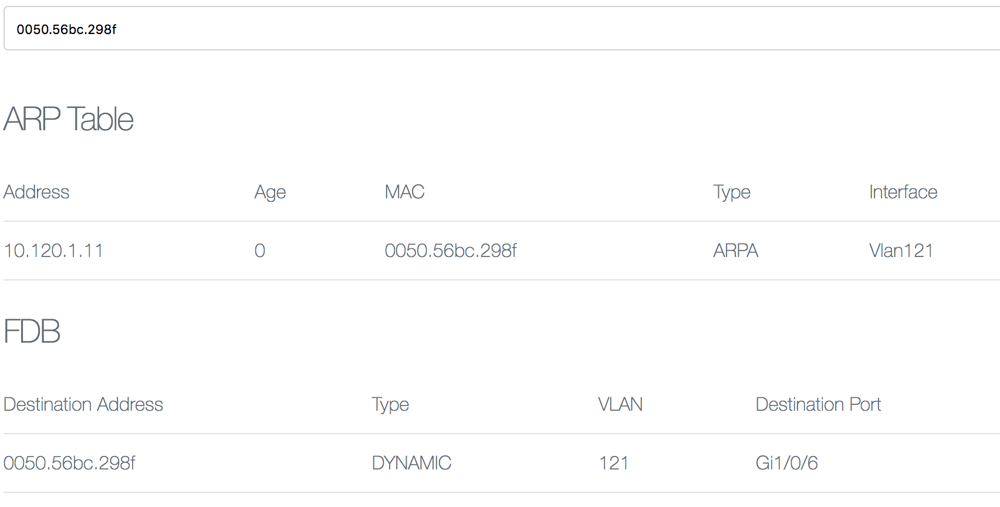

# Device Tracker &middot; ARP/FDB Search

Search the ARP entries and Forwarding Database on Cisco switches.

This is meant to replace the slow and archaic method of getting this information via SNMP queries.

##### How to run
* Download the repository or `git clone` the code
* `python get_info.py` to start collecting ARP and FDB info. Modify the list of switches you want to get info from.
* `ruby server.rb` to start the Sinatra frontend that lets you search the data captured.

###### Prerequisites
* Python ~3.7
* Ruby ~2.5.1
* Redis 4
* pip modules: redis, netmiko, schedule, textfsm
* rubygems: sinatra, redis
* ntc-templates

###### Todo
* Integrate with IOS-XE guestshell (IOX)
* Export JSON API endpoint
* Export [Prometheus](https://prometheus.io/docs/instrumenting/exporters) compatible statistics

The heavy lifting with this project is done by the awesome work from the folks behind the [netmiko](https://github.com/ktbyers/netmiko) and [paramiko](https://github.com/paramiko/paramiko) libraries.
